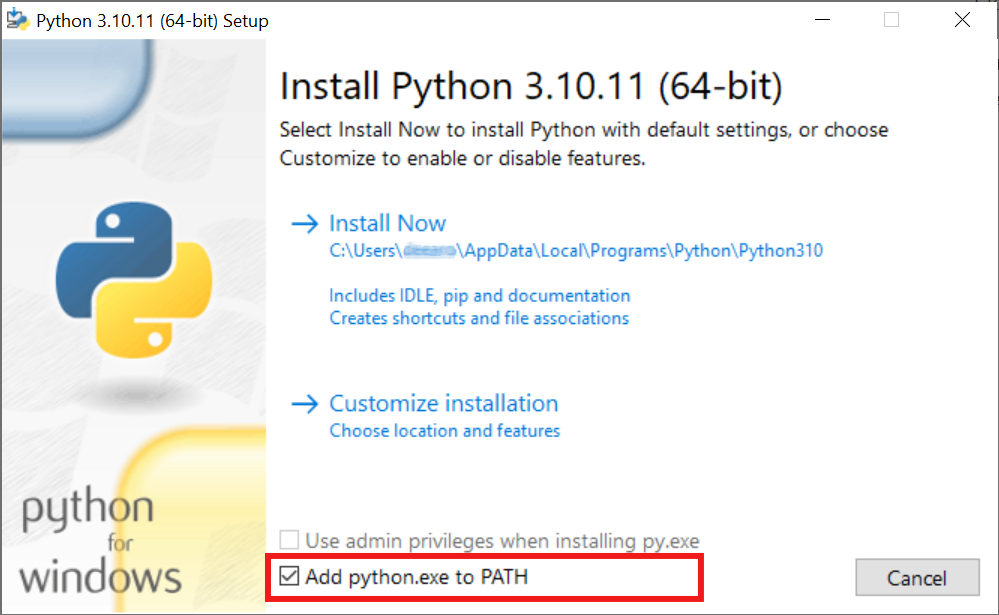
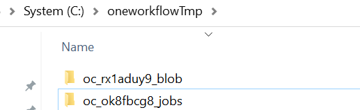

# improveflowH4-workflow
Repository to demonstrate the use of OneWorkflow. The repository contains various Jupyter notebook examples demonstrating how to run Sesam applications in a workflow including custom Python scripts.
This code is only a pilot and only intended for testing. Currently we have support for 
Sima, Wasim, Sestra, GeniERuntime and Sesam Core. 

## Introduction to OneWorkflow
OneWorkflow is an integrated workflow development system designed to seamlessly incorporate different aspects of the workflow process, including various tools, modules, and services, to create a comprehensive and interconnected solution. This integration streamlines the workflow, improves efficiency, and facilitates a more cohesive and unified approach to the development process. OneWorkflow has a UI-less interface, focusing on providing a powerful backend for workflow automation. It has also the capability to use the same code for running locally or in the cloud using OneCompute.

## Prerequisites required
### Python
Install Python 3.10, 3.11 or [3.12](https://www.python.org/downloads/release/python-31011/), typically for windows you want this [version](https://www.python.org/downloads/release/python-3122/).  One important note during the installation is to select the option 'Add python.exe to the PATH' (as shown in the image below). This option is turned off by default, so make sure to activate it for a smoother development experience

Verify the Default Python Version: To ensure a smooth development experience, it's important to confirm the default Python version on your system, especially if you have multiple Python installations:
* Start the command line (Windows-start-menu --> type cmd --> enter)
* Type `python --version` enter

### VSCode
Download and install Visual Studio Code from the official website. Visual Studio Code is a free, open-source code editor that provides excellent support for various programming languages and extensions, making it a popular choice for developers.
[VSCode](https://code.visualstudio.com/download) including the following extensions (install them after VSCode is installed). Jupyter and Python will most likely be installed automatically when opening an ipynb file.
* [Python extension](https://code.visualstudio.com/docs/languages/python), [download link](https://marketplace.visualstudio.com/items?itemName=ms-python.python)
* [Jupyer Notebook extension](https://code.visualstudio.com/docs/datascience/jupyter-notebooks), [download link](https://marketplace.visualstudio.com/items?itemName=ms-toolsai.jupyter)

### git 
You also need [git](https://git-scm.com/downloads) for cloning this code. 
With git installed you can clone this repository by starting a command line prompt  in the folder where you want this repository to be located:
`git clone https://github.com/dnv-opensource/improveflowH4-workflow.git`

You need the relevant Sesam products  with license for local runs. In addition you need [Application Version Manager](https://sesam.dnv.com/download/windows/applicationversionmanager_3200_inst_win.zip) (no license required) for local execution. You can get the Sesam applications here: https://sesam.dnv.com/download/programs.html.

To run in the cloud you need to contact DNV and have an account in https://test.onecompute.dnv.com/ 

Follow the instructions in [the installation notebook ](installation/installation.ipynb) to see how to install the required tools. They are required for all the notebooks.

## Examples provided
1. [SE28 Example](SE28ExampleSimaWasimSestra/SE28ExampleSimaWasimSestra.ipynb)  demonstrates how to do a parametrized run of Sima, Wasim and Sestra and postprocessing using SifIO. 
2. [SesamCoreExample](SesamCoreExample/SesamCoreExample.ipynb)  demonstrates how to run Sesam Core Fatigue hotspot using OneWorkflow. See the Sesam Core UM for details. 
3. [GeniERuntimeExample](GeniERuntimeExample/GeniERuntimeExample.ipynb) demonstrates how to do a parametrized study of a container ship using GeniERuntime and some trivial post processing using SifIO.
4. [SimaExamples](SimaExamples) contains four examples running only Sima:

    1. [SimaExample.ipynb](SimaExamples/SimaExample.ipynb) notebook example
    2. [SimaExample.py](SimaExamples/SimaExample.py) same as above but the code organized in a standalone Pytohn script
    3. [SimaExampleInplace.ipynb](SimaExamples/SimaExampleInPlace.ipynb) notebook example, but using in-place execution locally
    4. [SimaExampleInplace.py](SimaExamples/SimaExampleInPlace.py) same as above but the code organized in a standalone Pytohn script
    

## Notes on local execution
* The local execution is designed to simulate a cloud run. Because of this random generated folder names where the job will be executed is created within the temporary folder. Folders named blob is where the files will be uploaded before the job is executed, while the job folder is where the actual workflow will be executed: 

* While this option is useful for understand how the analysis will be executed in the cloud, there is also an option for running *in-place execution*, i.e. there will be no copying from files to a blob folder, the execution folder (job) folder is used directly for execution, and example of such analysis is [SimaExampleInplace.ipynb](SimaExamples/SimaExampleInPlace.ipynb).
* For Sima you will find a `runsima.bat` in the job folder. This may be used to debug possible issues with Sima execution.