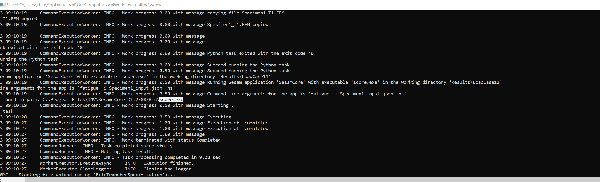

# improveflowH4-workflow
Repository to demonstrate the use of OneWorkflow. The repository contains various Jupyter notebook examples demonstrating how to run Sesam applications in a workflow including custom Python scripts.
This code is only a pilot and only intended for testing. Currently we have support for 
Sima, Wasim, Sestra, GeniERuntime and Sesam Core. 

## Prerequisites 
You need the relevant Sesam products  with license for local runs. In addition you need Application Version Manager for local execution. You can get the Sesam applications here: https://sesam.dnv.com/download/programs.html.
To run in the cloud you need to contact DNV and have an account in https://test.onecompute.dnv.com/ 
You also need git for cloning this code: https://git-scm.com/downloads 
With git installed you can clone this repository with `git clone https://github.com/dnv-opensource/improveflowH4-workflow.git`. (Start a command line prompt in the folder where you want this repository to be located.)

## To run the examples do the following:
1. Install Python 3.10 if needed (https://www.python.org/downloads/release/python-31011/), typically for windows you want this [version](https://www.python.org/ftp/python/3.10.11/python-3.10.11-amd64.exe). No Python version earlier than 3.10 is supported, but it may work with later versions. You should select adding Python to your path during installation. If not you need to add it manually. You then need both:  
`C:\Users\USERNAME\AppData\Local\Programs\Python\Python310\Scripts\` and 
`C:\Users\USERNAME\AppData\Local\Programs\Python\Python310\`

2. Set up a jupyter notebook environment, personally I like this https://code.visualstudio.com/docs/datascience/jupyter-notebooks, [download link](https://code.visualstudio.com/download#). When loading the notebook files (*.ipynb files) you will be prompted to install the relevant extensions for Python  and Jupyter. 

3. Follow the instructions in [the installation notebook ](installation.ipynb) to see how to install the required tools. They are required for all the notebooks.

## Examples provided
1. [SE28 Example](SE28ExampleSimaWasimSestra/workflowCoreDemoSE28SestraAndWasim.ipynb)  demonstrates how to do a parametrized run of Sima, Wasim and Sestra and postprocessing using SifIO. 
2. [SesamCoreExample](SesamCoreExample/SesamCoreExample.ipynb)  demonstrates how to run Sesam Core Fatigue hotspot using OneWorkflow. See the Sesam Core UM for details. 
3. [GeniERuntimeExample](GeniERuntimeExample/GeniERuntimeExample.ipynb) demonstrates how to do a parametrized study of a container ship using GeniERuntime and some trivial post processing using SifIO.

## Notes on local execution
The local execution is designed to simulate a cloud run. Because of this random generated folder names where the job will be executed is created within the temporary folder. Folders named blob is where the files will be uploaded before the job is executed, while the job folder is where the actual workflow will be executed: 
For Sima you will find a `runsima.bat` in the job folder. This may be used to debug possible issues with Sima execution.
During local execution a dos window will pop up starting the OneWorkflowWorkerHost. Here information about execution printed. You may use this window to help debugging issues with the execution. You may search in this window by typing `ctrl+f`:

When you are done with a notebook, you should close down the OneWorkflowWorkerHost application before you start a new example as you can only have one worker host open at a time.